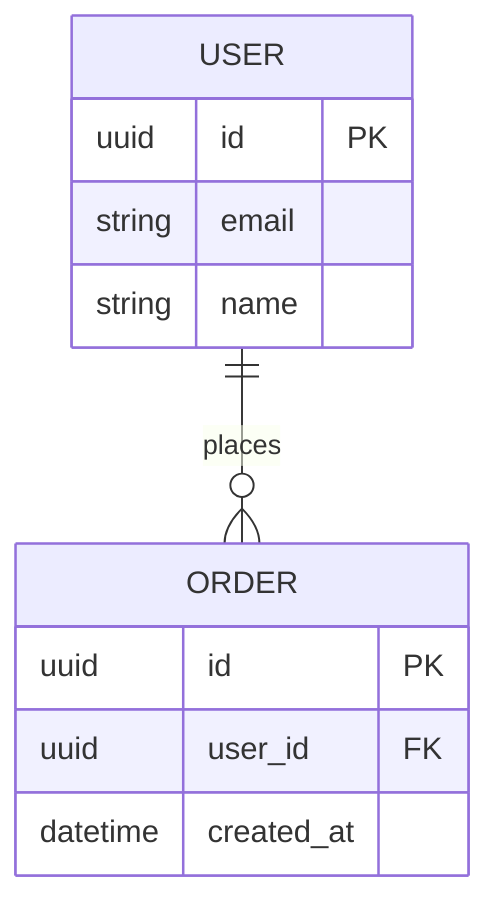

Журнал взаємодії з AI (Prompt History)

## 1-ий Запит
Промт - "дивись чи правильно я розумію що в цій лабі мені потрібно

1) знайти якийсь сайт

2) прописати в спек мд тільки словами які є сутності атрибути та зв'язки

3) зробити ер диаграму них і покращити

4) і потім в дефенсе мд написати що я змігив в діаграмі від спек мд? 
 "

 Відповідь - "Ти вловив загальну суть, але **є кілька дуже важливих нюансів та відмінностей у правилах**, на яких викладач (Дмитро Олександрович) робить акцент і за які часто знімають бали (дивись блок «Типові помилки»).

Ось детальний розбір твоїх пунктів і те, як це має виглядати за вимогами завдання:

---

### 1. «Знайти якийсь сайт»

* **У завданні:** Сказано **«Обрати домен (напр. онлайн-магазин, бронювання, бібліотека), описати в README.md»**.
* Тобто не обов'язково копіювати реальний сайт «один в один». Ти обираєш предметну область (домен) і в `README.md` описуєш її суть: що це за система, для кого вона, які бізнес-процеси покриває.

---

### 2. «Прописати в spec.md тільки словами які є сутності атрибути та зв'язки»

* **Майже так, але з додаванням критеріїв!**
* У `spec.md` описуєш:
1. Сутності, їхні атрибути (обов'язково з типами: string, number, uuid тощо) та зв'язки між ними словами.
2. **Критерії прийняття (Acceptance Criteria)** — наприклад, нормалізація (3NF), узгоджені типи ідентифікаторів, правила цілісності тощо.


* **Зверни увагу на примітку про ШІ:** *(з AI — це і є задача для AI)*. Якщо генеруєш діаграму за допомогою ШІ, у репозиторії мають бути збережені промпти/задачі, бо одна з типових помилок: *«Модель згенеровано ШІ, а подано як ручну; сам промт/задача до ШІ не збережені»*.

---

### 3. «Зробити ер диаграму них і покращити»

* **Як робити діаграму:**
* У **декларативному синтаксисі** — `Mermaid erDiagram` або `PlantUML` (текстом прямо в git).
* **Концептуальна/логічна модель, а не фізична БД:** Ніяких сполучних таблиць (join tables, наприклад `user_roles`) для чистого «багато-до-багатьох» ($M:N$). У чистому $M:N$ просто показується зв'язок сутностей `}o--o{`. Асоціативна таблиця додається **тільки** тоді, коли зв'язок сам несе власні атрибути (наприклад, `OrderItem`, де є `quantity`, `price_at_purchase`).


* **Як покращувати (КРИТИЧНО ВАЖЛИВИЙ ПУНКТ):**
* Викладач окремо виділив: **«топ-3 виправлення через зміну spec/критеріїв (коміти), а не ручний патч»**.
* Тобто логіка така: ти зробив аудит моделі (кардинальності, ключі, нормалізація) $\to$ знайшов невідповідність чи помилку $\to$ **ти спочатку оновлюєш `spec.md` (фіксуєш це в коміті)** $\to$ потім оновлюєш діаграму, щоб вона відповідала оновленій специфікації.
* **Діаграма і `spec.md` в фіналі мають збігатися на 100%!** Назви полів і типи мають бути ідентичними (не можна, щоб у тексті було `price`, а в діаграмі `unit_price`).


---

### 4. «І потім в DEFENSE.md написати що я змінив в діаграмі від spec.md?»

* **Ні, якраз навпаки! У фіналі розбіжностей між діаграмою та spec.md бути НЕ ПОВИННО.**
* Завдання `DEFENSE.md` інше:
1. **Чому цей домен** (обґрунтування вибору предметної області).
2. **Чому така нормалізація** (пояснити рішення щодо нормальних форм, чому саме так спроєктовані сутності).
3. **Пункт «Перевірка» (узгодженість spec $\leftrightarrow$ модель)** — заповнити розділ, де демонструється, що діаграма відповідає специфікації.
4. Якщо критерії (наприклад, 3NF, типізовані ID) описані в `DEFENSE.md`, вони **обов'язково мають бути зафіксовані і в `spec.md**`.


---

### Шпаргалка покрокового плану:

1. **`README.md`**: обрати та коротко описати домен.
2. **`spec.md`**: текстовий опис сутностей, полів з типами, кардинальностей ($1:1$, $1:N$, $M:N$) + критерії прийняття.
3. **`diagram` (Mermaid/PlantUML)**: декларативний код ER-діаграми (без зайвих junction-таблиць).
4. **Аудит та правки**: якщо знайдено баги чи нормалізацію — правити через окремі зрозумілі коміти (не `fix`, а змістовні повідомлення), синхронізуючи `spec.md` та код діаграми.
5. **`DEFENSE.md`**: аргументація вибору домену, пояснення нормалізації та заповнений блок перевірки відповідності.
6. Оформити через **Pull Request (PR)** на GitHub. "


## 2-ий Запит

Промт - " тоесть если я в draw io сделаю ерд то єто не правильно? "

Відповідь - " Так, робити просто в **Draw.io** — це **помилка**, за яку викладач зніме бали або відправить на перездачу.

У завданні чітко вказані вимоги до артефакту:

> **«Артефакт (текст + рендер): ER-модель у декларативному синтаксисі (Mermaid erDiagram або PlantUML)... Рендер — ER-діаграма з опису.»**

Тобто суть цієї лаби — навчитися підходу **Diagram-as-Code** (діаграма як код):

* Ти пишеш код текстом (наприклад, у блоці `mermaid ... ` прямо в Markdown-файлі або в `.puml` файлі).
* GitHub автоматично рендерить його в красиву графічну схему прямо в Pull Request.
* Усі правки між комітами будуть видні як звичайний текстовий `git diff` (змінив рядок коду — змінилась діаграма). Якщо зберегти картинку з Draw.io, git не зможе показати дифи змін.

### Як це виглядає на практиці (Mermaid)

Замість малювання мишкою в Draw.io, ти просто пишеш у файлі:



GitHub сам згенерує з цього картинку, і це на 100% задовольнить вимогу *«декларативний синтаксис (Mermaid/PlantUML)»*." 

## 3-ій Запит

Промт - "смотри мне нужно что бы ты сделал для меня для той лабораторной работы readme я выбрал домен leetcode.com"

Відповідь - "# README.md

## Предметна область: Платформа алгоритмічної підготовки (аналог LeetCode)

### 1. Опис системи

Проєкт описує модель даних для вебплатформи з алгоритмічної підготовки та технічних співбесід. Система забезпечує взаємодію користувачів із банком алгоритмічних завдань, перевірку розв'язків через автоматизовані тести та збереження статистики виконання.

### 2. Ключові бізнес-процеси

* **Каталогізація завдань:** адміністрування задач із розподілом за складністю (Easy, Medium, Hard), категоріями та тематичними тегами (наприклад, Dynamic Programming, Arrays, Graphs).
* **Подання розв'язку (Submission):** користувач надсилає код обраною мовою програмування; система зберігає статус виконання (Accepted, Wrong Answer, Time Limit Exceeded), використану пам'ять та час виконання.
* **Тестування:** кожне завдання має набір верифікаційних тест-кейсів (вхідні дані та очікуваний результат), включно з прихованими тестами для фінальної перевірки.
* **Обговорення та розбір:** користувачі можуть публікувати авторські розв'язки та залишати коментарі до конкретної задачі.

### 3. Межі домену (Scope)

Модель фокусується на сутностях збереження контенту, тестування та історії сабмітів:

* **Основні сутності:** Користувач (`User`), Завдання (`Problem`), Тег (`Tag`), Подання (`Submission`), Мова програмування (`Language`), Тест-кейс (`TestCase`), Рішення/Допис (`EditorialPost`).
* **Поза межами:** Фінансовий білінг (підписка Premium), WebRTC-відеочати для mock-інтерв'ю та низькорівнева черга виконання коду в пісочниці (Sandbox execution queue).

---

Скласти для цього домену `spec.md` із сутностями, типами та критеріями нормалізації 3NF?"

## 4-ий Запит

Промт - "У контексті LeetCode та нашої моделі даних ці два поняття означають наступне:

---

### 1. Тег (`Tag`)

Це **тематична мітка або категорія**, яка прив'язується до задачі, щоб користувачі могли шукати задачі за конкретними алгоритмами, структурами даних чи компаніями.

* **На самому LeetCode:** це плашки під назвою задачі типу `Array`, `Hash Table`, `Dynamic Programming`, `Binary Search`, `Amazon` тощо.
* **Як сутність у базі даних:**
* Має свої атрибути: унікальний `id`, назву `name` (наприклад, `"Two Pointers"`), slug для URL (`"two-pointers"`).
* **Зв'язок із задачами:** «Багато-до-багатьох» ($M:N$). В однієї задачі може бути багато тегів (наприклад, задача *Two Sum* має теги `Array` та `Hash Table`), і під одним тегом є сотні різних задач.
* *Важливий момент для нашої лаби:* оскільки у чистому зв'язку між задачею і тегом немає додаткових даних, у концептуальній ER-діаграмі вони пов'язуються напряму без проміжної сутності.


---

### 2. Подання (`Submission`)

Це **факт відправки користувачем свого коду на перевірку** (коли ти тиснеш кнопку **Submit** на сторінці задачі).

* **На самому LeetCode:** це кожен запис на вкладці «Submissions», де показано: зелений `Accepted` чи червоний `Wrong Answer`, час виконання (`Runtime: 45 ms`), пам'ять (`Memory: 16.4 MB`) тощо.
* **Як сутність у базі даних:**
* Це самостійна сутність, яка фіксує спробу розв'язку.
* Її атрибути:
* `id` — унікальний номер спроби.
* `source_code` — сам код програми, який написав користувач.
* `status` — вердикт тестуючої системи (`Accepted`, `Wrong Answer`, `Time Limit Exceeded`, `Runtime Error`).
* `execution_time_ms` — скільки мілісекунд виконувався код.
* `memory_used_kb` — скільки кілобайт пам'яті спожив процес.
* `submitted_at` — точний час відправки.


* **Зв'язки:**
* Багато сабмітів належать **одному користувачу** (`User` $1:N$ `Submission`).
* Багато сабмітів відправляються до **однієї конкретної задачі** (`Problem` $1:N$ `Submission`).
* Кожен сабміт написаний **однією конкретною мовою програмування** (`Language` $1:N$ `Submission`, наприклад Python, C++, Java)."

## 5-ий Запит

Промт - "а в спек мд потрібно писати string чи varchar и как лучше оформить сутность"

Відповідь - "### 1. `string` чи `varchar`?

Однозначно пиши **`string`** (або концептуальні типи: `int`, `boolean`, `datetime`, `uuid`).

Чому саме так:

* У завданні є чітке застереження: **«Без фізичної схеми БД (SQL DDL / ORM) — це предмет курсу баз даних»**.
* `VARCHAR(255)`, `BIGINT`, `TEXT` — це специфіка **фізичного рівня конкретної СУБД** (PostgreSQL, MySQL).
* На етапі концептуальної та логічної ER-моделі використовують абстрактні, мовно-незалежні типи: `string`, `int`, `float`, `boolean`, `datetime`, `uuid`.
* **Головне правило викладача:** типи мають бути **узгодженими** (якщо `id` скрізь `uuid` або `int`, не роби в одній сутності `id: int`, а в зовнішньому ключі `user_id: string` — за це в типових помилках окремо знімають бали: *«Неузгоджені типи ідентифікаторів»*).

---

### 2. Як найкраще оформити сутність у `spec.md`?

Найкращий і найбезпечніший варіант перед викладачем — зробити **структурований опис**, де чітко розбито:

1. Опис сутності (що це таке).
2. Атрибути: назва, концептуальний тип, ключ (PK / FK), обов'язковість (Required / Optional) та стислий коментар.
3. Зв'язки з іншими сутностями (із зазначенням кардинальності).

Ось еталонний приклад оформлення для сутності `Submission` («Подання»):

---

#### Приклад для `spec.md`:

### 3.4. Сутність: Submission (Подання розв'язку)

**Опис:** Фіксує окрему спробу користувача надіслати програмний код для перевірки на тестових даних конкретної задачі.

**Атрибути:**

* `id` (`uuid`, Primary Key, Required) — унікальний ідентифікатор подання.
* `user_id` (`uuid`, Foreign Key, Required) — ідентифікатор користувача, який надіслав розв'язок.
* `problem_id` (`uuid`, Foreign Key, Required) — ідентифікатор задачі, до якої надіслано розв'язок.
* `language_id` (`uuid`, Foreign Key, Required) — мова програмування розв'язку.
* `source_code` (`string`, Required) — повний текст вихідного коду розв'язку.
* `status` (`string`, Required) — вердикт системи тестування (наприклад, `Accepted`, `Wrong Answer`, `Time Limit Exceeded`).
* `runtime_ms` (`int`, Optional) — тривалість виконання тестів у мілісекундах (null, якщо код не скомпілювався).
* `memory_kb` (`int`, Optional) — обсяг використаної оперативної пам'яті у кілобайтах.
* `submitted_at` (`datetime`, Required) — дата й час відправки.

**Зв'язки:**

* **`User` $\to$ `Submission` (1 до багатьох / $1:N$):** Один користувач може зробити багато подань (`0..*`), але кожне подання належить рівно одному користувачу (`1..1`).
* **`Problem` $\to$ `Submission` (1 до багатьох / $1:N$):** До однієї задачі може бути надіслано багато подань (`0..*`), але кожне подання стосується виключно однієї задачі (`1..1`).
* **`Language` $\to$ `Submission` (1 до багатьох / $1:N$):** Одна мова програмування може бути використана в багатьох поданнях (`0..*`), кожне подання виконується однією мовою (`1..1`).

---

### Чому такий формат ідеальний:

1. **Збіг назв 1-в-1:** У діаграмі Mermaid ти запишеш рівно `runtime_ms int`, `submitted_at datetime` — і в тебе не виникне розбіжності між `spec.md` і схемою.
2. **Є кардинальності словами:** Викладач вимагає прописати зв'язки та кардинальності словами в специфікації.
3. **Критерії зафіксовані:** Видно єдиний стандарт ідентифікаторів (`uuid`), нормалізацію (довідник мов винесений окремо в `Language`, а не просто текстом у кожному сабміті)."


## 6-ий Запит

Промт - "а какие атрибуті у тега могут быть?"

Відповідь - "Для сутності **`Tag` (Тематична мітка / Категорія)** у концептуальній моделі достатньо компактного, але функціонального набору атрибутів:

* `id` (`uuid`, Primary Key, Required) — унікальний ідентифікатор тегу.
* `name` (`string`, Required) — офіційна назва тегу (наприклад, `"Dynamic Programming"`, `"Binary Search"`).
* `slug` (`string`, Required) — URL-ідентифікатор для маршрутизації та фільтрації (наприклад, `"dynamic-programming"`).
* `category` (`string`, Required) — група тегу (наприклад, `"Data Structure"`, `"Algorithm"`, `"Company"`), щоб розділяти теги алгоритмів від тегів компаній типу Google чи Amazon.
* `description` (`string`, Optional) — коротке текстове пояснення концепції тегу для довідкової підказки на сторінці каталогу.

---

**Як оформити опис сутності для `spec.md`:**

**Сутність: Tag (Тематична мітка)**

* **Опис:** Використовується для категоризації та фільтрації задач за алгоритмами, структурами даних або контекстом співбесід.
* **Атрибути:**
* `id` (`uuid`, Primary Key, Required)
* `name` (`string`, Required)
* `slug` (`string`, Required)
* `category` (`string`, Required)
* `description` (`string`, Optional)


* **Зв'язки:**
* **`Problem` $\leftrightarrow$ `Tag` ($M:N$, багато-до-багатьох):** Одна задача може мати від нуля до кількох тегів (`0..*`), і під один тег може підпадати довільна кількість задач (`0..*`). Оскільки сам зв'язок не несе специфічних даних (як-от кількість чи дата додавання), сполучна таблиця в концептуальній ER-діаграмі не створюється."


## 6-ий Запит

Промт - "а для тест кейсов"

Відповідь - "Для сутності **`TestCase` (Тест-кейс / Тестові дані)** потрібен набір атрибутів, що описує вхідні аргументи, еталонний вивід та статус видимості тесту:

* `id` (`uuid`, PK) — унікальний ідентифікатор тесту.
* `problem_id` (`uuid`, FK) — посилання на задачу, до якої належить тест.
* `input_data` (`string`) — вхідні параметри функції або вхідний потік даних (наприклад, `"[2,7,11,15], target = 9"`).
* `expected_output` (`string`) — очікуване повернене значення (наприклад, `"[0,1]"`).
* `is_sample` (`boolean`) — прапорець публічного прикладу (чи показується тест у самій умові задачі як Example 1, 2, чи є прихованим системним тестом).
* `order_index` (`int`) — порядковий номер для черговості запуску тестів у ранері.

---

**Оформлення для `spec.md`:**

**Сутність: TestCase (Тест-кейс)**

* **Опис:** Містить набір верифікаційних даних для перевірки коректності алгоритмічного розв'язку конкретної задачі.
* **Атрибути:**
* `id` (`uuid`, PK)
* `problem_id` (`uuid`, FK)
* `input_data` (`string`)
* `expected_output` (`string`)
* `is_sample` (`boolean`)
* `order_index` (`int`)


* **Зв'язки:**
* **`Problem` $\to$ `TestCase` ($1:N$):** Одна задача має багато тестових кейсів (`1..*`), але кожен тест-кейс належить виключно одній задачі (`1..1`)."

## 7-ий Запит

Промт - "смотри я вот так вот написал а как мне грамотно в спек мд прописать их связи "

Відповідь - "Тепер сутність `User` на місці, але в `EditorialPost` і `Submission` залишилися критичні помилки, через які лабу повернуть на доопрацювання.

### 1. Що треба терміново виправити в тексті

* **`EditorialPost` (порушення 3NF та хибні FK):**
* Поля `runtime_ms`, `memory_kb`, `submuitted_at` позначені як `FK` — це помилка, це звичайні скалярні значення, а не ключі.
* Якщо `EditorialPost` має `submissionID`, то поля `runtime_ms`, `memory_kb`, час, а також `problemID` і `languageID` **не можна дублювати** — вони вже є всередині зв'язаного `Submission`. Це класичне порушення 3-ї нормальної форми (транзитивна залежність).
* У `EditorialPost` відсутній сам зміст статті (назва, текст).
* *Як має бути:*
```markdown
## EditorialPost
- editorialPostID - PK - int
- userID - FK - int
- submissionID - FK - int
- title - - string
- content - - string
- created_at - - datetime

```


* **Одрук у `Submission`:**
* `submuitted_at` $\to$ виправ на `submitted_at` (щоб назва збігалася з діаграмою буква в букву).


* **Одрук у `TestCase`:**
* Регістр першої літери: `TestCaseID` краще написати як `testCaseID` для єдиного camelCase-стилю в усьому файлі.


---

### 2. Як прописати зв'язки в `spec.md`

Додай після опису сутностей окремий розділ зв'язків:

```markdown
## Зв'язки між сутностями (Relationships)

* **User — Submission (1:N, один-до-багатьох):**
  - Один користувач може надіслати багато розв'язків (0..*).
  - Кожне подання належить рівно одному користувачеві (1..1).
  - Зовнішній ключ: `Submission.userID` посилається на `User.userID`.

* **Problem — Submission (1:N, один-до-багатьох):**
  - До однієї задачі може бути створено багато подань (0..*).
  - Кожне подання стосується виключно однієї задачі (1..1).
  - Зовнішній ключ: `Submission.problemID` посилається на `Problem.problemID`.

* **Language — Submission (1:N, один-до-багатьох):**
  - Одна мова програмування використовується у багатьох поданнях (0..*).
  - Кожне окреме подання написане однією мовою (1..1).
  - Зовнішній ключ: `Submission.languageID` посилається на `Language.languageID`.

* **Problem — TestCase (1:N, один-до-багатьох):**
  - Одна задача має один або більше тест-кейсів для перевірки (1..*).
  - Кожен тест-кейс належить виключно одній конкретній задачі (1..1).
  - Зовнішній ключ: `TestCase.problemID` посилається на `Problem.problemID`.

* **Problem — Tag (M:N, багато-до-багатьох):**
  - Одна задача може мати декілька тегів категорій (0..*).
  - Один тег може належати довільній кількості задач (0..*).
  - Зв'язок прямий концептуальний, без створення проміжної сполучної таблиці.

* **User — EditorialPost (1:N, один-до-багатьох):**
  - Один користувач може опублікувати багато дописів із розбором (0..*).
  - Кожен допис має рівно одного автора (1..1).
  - Зовнішній ключ: `EditorialPost.userID` посилається на `User.userID`.

* **Submission — EditorialPost (1:1, один-до-одного):**
  - Конкретне подання розв'язку може бути використане для створення одного авторського розбору (0..1).
  - Кожен розбір базується на конкретному успішному поданні (1..1).
  - Зовнішній ключ: `EditorialPost.submissionID` посилається на `Submission.submissionID`.

```"

## 8-ий Запит

Промт - "что в відношеннях означає (0..*)"

Відповідь - "У моделюванні баз даних та ER-діаграмах запис **`(0..*)`** позначає **кардинальність зв'язку** (діапазон кількості пов'язаних екземплярів): **«від нуля до багатьох»**.

Він складається з двох меж `(min..max)`:

* **`0` (мінімум / обов'язковість):** зв'язок є **необов'язковим** (*optional*). Сутність може існувати взагалі без жодного пов'язаного запису.
* **`*` (максимум):** зв'язок є **множинним** (*many*). Записів може бути довільна кількість (1, 2, 100 тощо).

**Приклади на основі твого LeetCode:**

* **`User (1) — Submission (0..*)`**: Щойно зареєстрований користувач ще не відправив жодного розв'язку (їх `0`). Активний користувач міг розв'язати 500 задач (їх `*`).
* **`Problem (1) — Submission (0..*)`**: Нова опублікована задача ще не має жодної спроби розв'язку (`0`), але згодом їх можуть бути тисячі (`*`).

Для порівняння з іншими межами:

* **`(1..1)`**: рівно один обов'язковий зв'язок (наприклад, сабміт не може існувати без автора чи без задачі).
* **`(1..*)`**: один або більше, обов'язковий зв'язок (наприклад, задача обов'язково повинна мати хоча б один тест-кейс).
* **`(0..1)`**: нуль або один (наприклад, користувач може прив'язати телефон, а може ні)."

