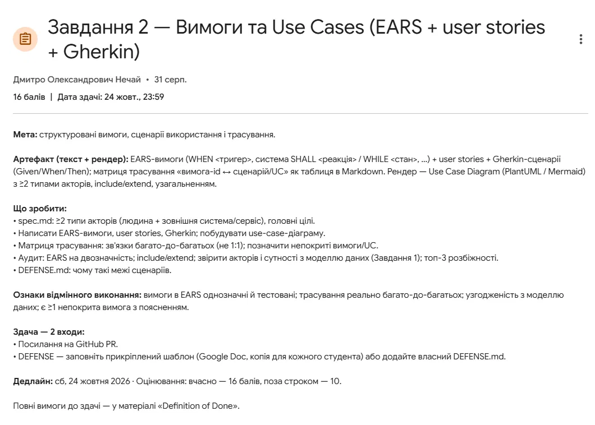
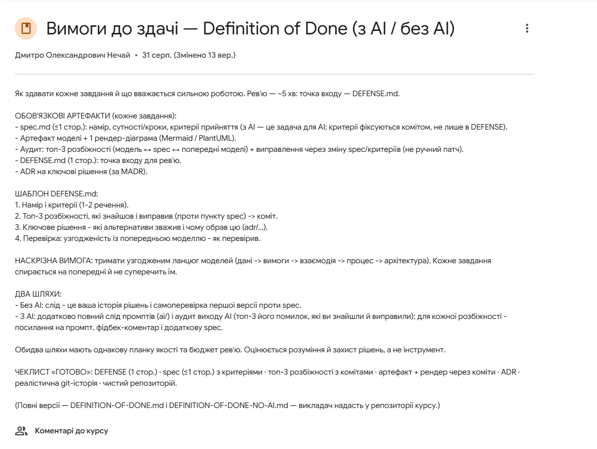

# 1
- Запит: можешь обьяснить что от меня хотят в этой лабе 

- Відповідь: Это лаба по требованиям и сценариям использования. Она продолжает Задание 1: ты берёшь ту же предметную область и модель данных и описываешь, что система должна делать и кто с ней взаимодействует. Всё должно быть согласовано с моделью из Задания 1.

Что нужно сдать

1. spec.md (не больше 1 страницы). Коротко: что это за система, кто в ней акторы и какие у них главные цели. Акторов нужно минимум два типа:

человек, например покупатель или администратор;
внешняя система или сервис, например платёжный шлюз, API Новой Почты или email-сервис.

Туда же пишутся критерии приёмки, то есть по каким признакам работа считается готовой. Их нужно закоммитить, а не только упомянуть в DEFENSE.

2. EARS-требования. Это шаблонный формат, в котором каждое требование получается однозначным и проверяемым. Основные шаблоны:

Ubiquitous (выполняется всегда): «Система SHALL хранить историю заказов клиента».
Event (реакция на событие): «WHEN клиент нажимает "Оформить заказ", система SHALL создать заказ со статусом "Новый"».
State (поведение в состоянии): «WHILE заказ в статусе "Оплачен", система SHALL запрещать изменение состава заказа».
Unwanted (ошибки): «IF платёжный шлюз не ответил за 10 с, THEN система SHALL показать ошибку и сохранить корзину».
Optional (опции): «WHERE у клиента есть промокод, система SHALL применить скидку».

Каждому требованию дай ID: REQ-01, REQ-02 и так далее. Важно: слова вроде «быстро», «удобно», «корректно» запрещены, потому что их нельзя проверить. Вместо них пиши конкретные числа и условия.

3. User stories. Формат: «Как покупатель, я хочу отслеживать заказ, чтобы знать, когда он приедет».

4. Gherkin-сценарии. Это конкретные тест-кейсы к историям:

gherkin
Scenario: Успешное оформление заказа
  Given клиент авторизован и в корзине есть товар
  When клиент подтверждает заказ
  Then создаётся заказ со статусом "Новый"

5. Матрица трассировки. Это таблица в Markdown: какие требования покрываются какими сценариями и use case. Главное условие: связи должны быть многие-ко-многим, а не 1:1. Один сценарий проверяет несколько требований, одно требование покрывается несколькими сценариями. Кроме того, нужна хотя бы одна непокрытая строка с объяснением. Это обязательный признак отличной работы. Например, нефункциональное требование «данные хранятся 3 года» сценарием не проверишь.

6. Use Case диаграмма в PlantUML или Mermaid. На ней должны быть:

минимум два типа акторов;
include — обязательное подповедение, например «Оформить заказ» включает «Рассчитать стоимость доставки»;
extend — необязательное расширение, например «Применить промокод» расширяет «Оформить заказ»;
обобщение (generalization) — например, «Зарегистрированный клиент» наследуется от «Клиент», или «Оплатить картой» наследуется от «Оплатить».

7. Аудит, топ-3 расхождения. Проверь свою же работу:

нет ли в EARS двусмысленностей;
правильно ли использованы include и extend (их часто путают);
совпадают ли акторы и сущности с моделью данных из Задания 1. Например, в сценарии есть «Промокод», а в модели данных такой сущности нет. Это расхождение.

Найди три таких расхождения и исправь их через изменение spec или критериев. Каждое исправление оформи отдельным коммитом.

8. DEFENSE.md (1 страница) по шаблону:

Намерение и критерии (1–2 предложения).
Топ-3 расхождения со ссылками на коммиты.
Ключевое решение: какие альтернативы рассматривал и почему выбрал эту (ссылка на ADR). Для этой лабы в первую очередь почему границы сценариев именно такие: почему этот use case отдельный, а тот вынесен в include, что вообще не входит в систему.
Как проверил согласованность с моделью из Задания 1.

9. ADR (Architecture Decision Record) по шаблону MADR: короткий документ о ключевом решении (контекст, варианты, выбор, последствия).

Как сдавать
Ссылка на GitHub Pull Request.
DEFENSE: либо Google Doc по шаблону, либо DEFENSE.md в репозитории.
Дедлайн 24 октября, 23:59. Вовремя — 16 баллов, после — 10.
Про AI

Можно делать с AI или без. Если используешь AI, нужно дополнительно положить в папку ai/ все промпты. Также нужно найти три ошибки, которые сделал AI, и для каждой указать промпт, свой комментарий и исправление. Оценивают понимание и умение защитить решения, а не инструмент. Ещё проверяют «реалистичную git-историю»: работа должна появляться постепенно, серией коммитов, а не одним коммитом со всем сразу.

Примерная структура репозитория:

spec.md
requirements.md      (EARS + user stories)
features/*.feature   (Gherkin)
traceability.md      (матрица)
usecase.puml         (диаграмма)
adr/0001-....md
DEFENSE.md
ai/                  (если с AI)

Какая предметная область была у тебя в Задании 1? Могу на её основе помочь составить акторов, первые EARS-требования и черновик диаграммы.

# 2
- Запит: а если я первую лабораторную работы делал про leetcode я смогу єту тоже сделать про него?

- Відповідь: Да, и даже нужно. Ты в любом случае продолжаешь тему из первой лабы: в требованиях есть «сквозная» цепочка «данные → требования → взаимодействие → процесс → архитектура», и каждое задание опирается на предыдущее. LeetCode для этого хорошо подходит: там есть и разные типы пользователей, и внешние сервисы.

Главное, чтобы акторы и сущности в этой лабе совпадали с тем, что у тебя есть в модели данных из Задания 1 (например, User, Problem, Submission, TestCase, Contest). Сверка с этой моделью — часть аудита.

Как LeetCode ложится на требования этой лабы:

**Акторы.** Люди: Пользователь (Guest), Зарегистрированный пользователь, Premium-пользователь, Автор задач или Администратор. Внешние системы: платёжный сервис (оплата Premium), OAuth-провайдер (вход через GitHub или Google), и возможно изолированная песочница для запуска кода (Judge), если ты считаешь её внешним сервисом.

**Обобщение.** Premium-пользователь наследуется от Зарегистрированного пользователя, а тот от Гостя. Каждый следующий умеет всё, что предыдущий, плюс что-то своё.

**Include.** «Отправить решение» включает «Прогнать тесты» и «Сохранить Submission». «Купить Premium» включает «Провести оплату».

**Extend.** «Посмотреть официальное решение» расширяет «Открыть задачу» (только для Premium). «Показать подсказку» расширяет «Решать задачу».

**Примеры EARS:**
- WHEN пользователь отправляет решение, система SHALL запустить его на всех тест-кейсах задачи и вернуть вердикт (Accepted / Wrong Answer / Time Limit Exceeded / Runtime Error).
- IF время выполнения решения превышает лимит задачи, THEN система SHALL прервать выполнение и вернуть вердикт Time Limit Exceeded.
- WHILE контест активен, система SHALL скрывать решения других участников.
- WHERE у пользователя есть Premium, система SHALL показывать задачи с пометкой Premium.

**Непокрытое требование.** Например, «система SHALL изолировать код пользователя от файловой системы сервера». Это важно, но простым Gherkin-сценарием это не проверишь. Так ты и объяснишь в матрице, почему оно не покрыто.

**Возможное расхождение для аудита.** Если в сценариях появится, например, «Подсказка» или «Контест», а в модели данных из первой лабы таких сущностей нет, это расхождение. Его нужно исправить и закоммитить.

Если скинешь модель данных из первой лабы (текст или диаграмму), я помогу составить список use case и EARS-требований, которые точно с ней совпадут.

# 3
- Запит: так сделай подробный план что мне еще осталось сделать и как

- Відповідь: Сегодня 28 сентября, до дедлайна (24 октября) почти четыре недели. Этого с запасом хватит, если делать по шагу. Ниже весь путь по порядку: что сделать, в какой файл и каким коммитом.

## Шаг 0. Подготовка репозитория
Создай ветку, например `lab2-requirements`, и папку под лабу. Положи туда (или просто держи под рукой) модель данных из первой лабы: с ней всё сверяется. Готовый spec.md закоммить первым: `docs: add spec with actors, scope and acceptance criteria`.

Коммить маленькими порциями и в разные дни. Преподаватель смотрит на «реалистичную git-историю», и один коммит «добавил всё» выглядит плохо.

## Шаг 1. Сверить spec с моделью из Задания 1
Проверь, что User, Problem, TestCase, Submission и Subscription действительно есть в твоей модели и называются так же. Если чего-то не хватает, пока просто запиши себе. Это готовые кандидаты в расхождения для аудита на шаге 7, так что сейчас ничего не исправляй молча.

## Шаг 2. User stories (`stories.md`)
Напиши 6–8 историй, хотя бы по одной на каждого актора. Дай им ID: US-01, US-02 и так далее. Например: «US-03: Как Пользователь, я хочу отправить решение задачи, чтобы узнать, проходит ли оно все тесты». Внешним системам истории не нужны: они участвуют в сценариях, но у них нет «желаний».

Коммит: `docs: add user stories`.

## Шаг 3. EARS-требования (`requirements.md`)
Нужно 10–14 требований с ID REQ-01… Используй все пять шаблонов (обычное, WHEN, WHILE, IF…THEN, WHERE), чтобы было видно, что ты понимаешь разницу. У каждого требования пометь, из какой user story оно выросло. Везде пиши конкретику: лимиты времени, статусы, количество попыток.

Одно требование заранее сделай непроверяемым через Gherkin. Например, про изоляцию кода пользователя от сервера. Потом это будет обязательная непокрытая строка в матрице.

Коммит: `docs: add EARS requirements`.

## Шаг 4. Gherkin-сценарии (`features/`)
Разбей сценарии по файлам: `auth.feature`, `problems.feature`, `submission.feature`, `premium.feature`. Дай сценариям ID (SC-01…) и помечай тегами требования, которые они проверяют, например `@REQ-03 @REQ-05`. Так матрица на шаге 6 почти соберётся сама.

Сразу закладывай многие-ко-многим: один сценарий должен проверять несколько требований. Для важных требований делай несколько сценариев: успешный путь и путь с ошибкой.

Коммит: `test: add Gherkin scenarios`. Можно разбить на 2–3 коммита по файлам.

## Шаг 5. Use Case диаграмма (`usecase.puml` + картинка)
Бери PlantUML: Mermaid плохо поддерживает use case диаграммы. Дай вариантам использования ID (UC-01…). Обязательно должны быть:
- обобщение акторов: Premium-пользователь → Пользователь → Гость;
- include: например, «Отправить решение» включает «Прогнать тесты»;
- extend: например, «Посмотреть официальное решение» расширяет «Открыть задачу».

Отрендерь диаграмму через плагин в VS Code или на plantuml.com и закоммить и исходник, и PNG/SVG: `docs: add use case diagram`.

## Шаг 6. Матрица трассировки (`traceability.md`)
Сделай таблицу: строки — REQ-xx, колонки — какие SC и UC их покрывают. Потом проверь три вещи:
- есть требование, покрытое 2+ сценариями;
- есть сценарий, покрывающий 2+ требования;
- есть хотя бы одна строка «не покрыто» с объяснением причины.

Коммит: `docs: add traceability matrix`.

## Шаг 7. Аудит (`audit.md`) и три исправления
Пройдись по трём направлениям: двусмысленности в EARS, правильность include и extend, соответствие акторов и сущностей модели из Задания 1. Выбери три лучших расхождения. Для LeetCode типичные такие:
- в требованиях есть Subscription (или Contest), а в модели данных такой сущности нет;
- у User в модели обязательное поле password, но при входе через OAuth пароля нет;
- в требовании осталось размытое слово («быстро вернуть вердикт») вместо числа;
- «Войти» нарисован через extend, хотя по смыслу это include, или наоборот.

Каждое исправление вноси **через изменение spec или критериев** и оформляй отдельным коммитом. Например: `fix(spec): add Subscription to entities — audit #1`. В audit.md для каждого расхождения укажи: что нашёл, какой пункт spec нарушен, как исправил, ссылку на коммит.

## Шаг 8. ADR (`adr/0001-use-case-boundaries.md`)
Опиши по шаблону MADR одно ключевое решение. Для этой лабы логичнее всего выбрать границы сценариев. Например, почему «Прогнать тесты» — это include, а не отдельный use case. Или почему контесты вынесены за рамки. Разделы шаблона: контекст, рассмотренные варианты, выбранный вариант, последствия.

Коммит: `docs: add ADR on use case boundaries`.

## Шаг 9. DEFENSE.md (1 страница)
Заполняй последним, когда всё остальное готово. Разделы:
1. Намерение и критерии: 1–2 предложения из spec.
2. Топ-3 расхождения со ссылками на коммиты из шага 7.
3. Ключевое решение со ссылкой на ADR.
4. Как проверил согласованность с моделью из Задания 1: например, «прошёл по всем сущностям в требованиях и сверил с ER-моделью».

Помни, что рецензент тратит на твою работу около 5 минут и начинает именно с этого файла.

## Шаг 10. Если делаешь с AI
Заведи папку `ai/` и сохраняй туда промпты по ходу работы, а не восстанавливай их в конце. Отдельно опиши три ошибки AI, которые ты нашёл: промпт, что было не так, как исправил.

## Шаг 11. Сдача
Запушь ветку и открой Pull Request в `main`. В описании PR коротко перечисли, что в нём есть. В Classroom сдай ссылку на PR и DEFENSE (либо заполненный Google Doc, либо ссылку на DEFENSE.md).

**Примерный темп:** первая неделя — шаги 1–3, вторая — шаги 4–6, третья — шаги 7–9. Последняя неделя остаётся запасом.

Если пришлёшь модель данных из первой лабы, начнём сразу с шагов 1–3: сверим сущности и напишем user stories и EARS-требования.

# 4
- Запит: помоги тогда сделать ears-требования

- Відповідь: # Вимоги (EARS)

Шаблони: **U** — Ubiquitous (завжди), **E** — Event-driven (WHEN), **S** — State-driven (WHILE), **N** — Unwanted behaviour (IF…THEN), **O** — Optional feature (WHERE).

Допустимі значення `Submission.status`: `Pending`, `Accepted`, `Wrong Answer`, `Time Limit Exceeded`, `Runtime Error`, `Compilation Error`.
Допустимі значення `Problem.difficulty`: `Easy`, `Medium`, `Hard`.
Допустимі значення `USER.role`: `user`, `admin`.

## Каталог задач
| ID | Тип | Вимога | US |
|---|---|---|---|
| REQ-01 | U | Система SHALL відображати для кожної задачі в каталозі її `title`, `difficulty` та всі пов'язані теги (`Tag.name`). | US-01 |
| REQ-02 | E | WHEN користувач обирає фільтри за складністю та/або тегами, система SHALL показувати лише задачі, що відповідають усім обраним фільтрам одночасно. | US-01 |

## Реєстрація та вхід
| ID | Тип | Вимога | US |
|---|---|---|---|
| REQ-03 | N | IF під час реєстрації вказано `username` або `email`, що вже належить іншому користувачу, THEN система SHALL відхилити реєстрацію та вказати, яке саме поле зайняте. | US-02 |
| REQ-04 | U | Система SHALL зберігати пароль користувача лише у вигляді хешу в полі `password_hash`. | US-02 |
| REQ-05 | E | WHEN OAuth-провайдер підтверджує автентифікацію, система SHALL увійти в акаунт з тим самим `email`, а якщо такого немає — створити новий `USER` з `role = user` і порожнім `password_hash`. | US-03 |

## Надсилання рішень
| ID | Тип | Вимога | US |
|---|---|---|---|
| REQ-06 | E | WHEN користувач відкриває форму надсилання рішення, система SHALL пропонувати вибір мови лише зі значень таблиці `Language`. | US-04 |
| REQ-07 | E | WHEN користувач надсилає рішення, система SHALL створити `Submission` зі статусом `Pending`, обраною мовою (`languageID`) і часом надсилання (`submitted_at`). | US-04 |
| REQ-08 | E | WHEN перевірку рішення на всіх тест-кейсах задачі завершено, система SHALL присвоїти `Submission` рівно один фінальний статус з допустимого переліку (крім `Pending`), а для статусу `Accepted` — зберегти `runtime_ms` і `memory_kb`. | US-04 |
| REQ-09 | N | IF виконання рішення на будь-якому тест-кейсі триває понад 2000 мс, THEN система SHALL зупинити перевірку й присвоїти статус `Time Limit Exceeded`. | US-04 |
| REQ-10 | N | IF фінальний статус — `Wrong Answer`, THEN система SHALL показати користувачу вхідні дані першого непройденого тест-кейсу, очікуваний і фактичний вивід. | US-04 |
| REQ-11 | E | WHEN користувач відкриває історію надсилань, система SHALL показувати лише його власні `Submission`, відсортовані від найновішого, зі статусом, мовою, `runtime_ms` і датою. | US-05 |
| REQ-12 | U | Система SHALL виконувати код користувача в ізольованому середовищі без доступу до файлової системи та мережі сервера. | US-04 |

## Розбори
| ID | Тип | Вимога | US |
|---|---|---|---|
| REQ-13 | N | IF користувач публікує розбір на основі `Submission`, що належить іншому користувачу або має статус, відмінний від `Accepted`, THEN система SHALL відхилити публікацію. | US-06 |
| REQ-14 | N | IF для обраного `Submission` уже існує `EditorialPost`, THEN система SHALL відхилити публікацію ще одного розбору. | US-06 |

## Premium
| ID | Тип | Вимога | US |
|---|---|---|---|
| REQ-15 | E | WHEN платіжний сервіс підтверджує успішну оплату, система SHALL встановити `has_premium = true` для користувача, що здійснив оплату. | US-07 |
| REQ-16 | N | IF платіжний сервіс повідомляє про відмову в оплаті, THEN система SHALL залишити `has_premium` без змін і показати користувачу причину відмови. | US-07 |
| REQ-17 | S | WHILE у користувача `has_premium = false`, система SHALL показувати задачі з `is_premium = true` у каталозі, але блокувати перегляд їхнього опису та надсилання рішень. | US-07, US-08 |
| REQ-18 | O | WHERE у користувача `has_premium = true`, система SHALL надавати доступ до опису задач з `is_premium = true` і надсилання рішень до них. | US-08 |

## Адміністрування
| ID | Тип | Вимога | US |
|---|---|---|---|
| REQ-19 | N | IF адміністратор зберігає задачу без жодного тест-кейсу, THEN система SHALL відхилити збереження. | US-09 |
| REQ-20 | N | IF користувач з `role = user` намагається створити або змінити задачу, THEN система SHALL відхилити дію. | US-09 |

# 5
- Запит: чи потрібно робити сценарії для сортування по тегам та по мові програмування?

- Відповідь: Правило простое: сценарий пишется только тогда, когда есть требование, которое он проверяет. Поэтому смотрим, что есть в requirements.md.

Теги — да, нужен. Есть REQ-02: «WHEN користувач обирає фільтри за складністю та/або тегами…». Без сценария оно останется непокрытым. Достаточно одного успешного сценария, и лучше сразу с комбинированным фильтром, потому что ключевое в требовании — «усім обраним фільтрам одночасно»:

gherkin
@REQ-01 @REQ-02
Scenario: Фільтрація задач за складністю та тегом
  Given у каталозі є задачі:
    | title        | difficulty | tags          |
    | Two Sum      | Easy       | Array, Hash   |
    | 3Sum         | Medium     | Array         |
    | Valid Anagram| Easy       | Hash          |
  When користувач обирає складність "Easy" і тег "Array"
  Then у каталозі відображається лише "Two Sum"

Этот сценарий заодно покрывает и REQ-01 (показ названия, сложности и тегов). Получается ещё одна связь многие-ко-многим в матрицу.

Язык программирования — только выбор языка при отправке, не сортировка. Есть REQ-06: при отправке решения можно выбрать язык только из таблицы Language. На него нужен сценарий, но его не обязательно делать отдельным: можно добавить шаг в успешный сценарий отправки решения. Тогда этот сценарий покроет REQ-06, REQ-07 и REQ-08 одновременно.

Сортировки или фильтрации по языку в требованиях нет, поэтому сценарий для неё писать не нужно. Если сценарий есть, а требования под ним нет, в матрице получится «лишняя» колонка, и рецензент спросит, откуда она взялась. Если хочешь такую функцию (например, фильтр истории отправок по языку), сначала добавь требование, например REQ-21, и только потом сценарий.

Одно уточнение по формулировке: в REQ-02 речь идёт о фильтрации (показать только подходящие задачи), а не о сортировке (изменить порядок). Это разные вещи, и на защите их лучше не путать. Единственная сортировка в требованиях — в REQ-11, история отправок «від найновішого».

# 6

- Запит: можешь подробней рассказать как сделать матрицу трассировки тут

- Відповідь: Матрица трассировки показывает, **какое требование каким сценарием проверяется и в каком use case реализовано**. Рецензент смотрит на неё, чтобы понять: всё ли покрыто, нет ли лишнего, и настоящие ли связи многие-ко-многим.

## Как её собрать, по шагам

**1. Дай ID всему, что связываешь.** Требования уже есть (REQ-01…REQ-20). Сценариям дай SC-01…, вариантам использования на диаграмме — UC-01…

**2. Помечай сценарии тегами требований.** В `.feature`-файле над каждым сценарием пиши, что он проверяет: `@REQ-07 @REQ-08`. Тогда матрицу не нужно придумывать, она просто собирается из тегов.

**3. Сделай две таблицы.**
- Основная: *требование → сценарии → UC → статус*. По ней видно покрытие.
- Обратная: *сценарий → требования*. По ней видно, что один сценарий проверяет несколько требований.

Вместе они и доказывают многие-ко-многим.

**4. Проверь три условия:**
- есть требование с 2+ сценариями;
- есть сценарий с 2+ требованиями;
- есть непокрытое требование с объяснением.

**5. Проверь автоматически.** Одна команда в терминале считает, сколько раз встречается каждый тег:
```bash
grep -rho "@REQ-[0-9]*" features/ | sort | uniq -c
```
Если какого-то REQ в выводе нет, значит, он не покрыт. Эту проверку можно описать в DEFENSE.md, в пункте «как проверил».

## Готовая матрица под наши требования

Сначала я расписал план сценариев и use case. Когда будешь писать `.feature`-файлы и диаграмму, ID должны совпасть с этими.

```markdown
# Матриця трасування

## Use Cases
| ID | Use Case | Актори | Зв'язок |
|---|---|---|---|
| UC-01 | Переглянути каталог задач | Гість | — |
| UC-02 | Фільтрувати задачі | Гість | extend UC-01 |
| UC-03 | Зареєструватися | Гість | — |
| UC-04 | Увійти через OAuth | Гість, OAuth-провайдер | — |
| UC-05 | Надіслати рішення | Користувач | include UC-06 |
| UC-06 | Перевірити рішення на тест-кейсах | — | включається в UC-05 |
| UC-07 | Переглянути історію надсилань | Користувач | — |
| UC-08 | Опублікувати розбір | Користувач | extend UC-07 |
| UC-09 | Оформити Premium | Користувач, Платіжний сервіс | — |
| UC-10 | Відкрити Premium-задачу | Premium-користувач | — |
| UC-11 | Створити задачу | Адміністратор | — |

## Сценарії
| ID | Сценарій | Файл |
|---|---|---|
| SC-01 | Фільтрація задач за складністю та тегом | problems.feature |
| SC-02 | Успішна реєстрація | auth.feature |
| SC-03 | Реєстрація з уже зайнятим email | auth.feature |
| SC-04 | Перший вхід через OAuth створює акаунт | auth.feature |
| SC-05 | Надіслане рішення отримує Accepted | submission.feature |
| SC-06 | Надіслане рішення отримує Wrong Answer | submission.feature |
| SC-07 | Рішення перевищує ліміт часу | submission.feature |
| SC-08 | Перегляд історії надсилань | submission.feature |
| SC-09 | Успішна публікація розбору | editorial.feature |
| SC-10 | Розбір на основі неприйнятого рішення | editorial.feature |
| SC-11 | Повторний розбір для того самого рішення | editorial.feature |
| SC-12 | Успішна оплата Premium | premium.feature |
| SC-13 | Відмова в оплаті Premium | premium.feature |
| SC-14 | Відкриття Premium-задачі без Premium | premium.feature |
| SC-15 | Збереження задачі без тест-кейсів | admin.feature |
| SC-16 | Користувач без ролі admin створює задачу | admin.feature |

## Вимога → сценарії → UC
| Вимога | Сценарії | UC | Статус |
|---|---|---|---|
| REQ-01 | SC-01 | UC-01 | ✅ |
| REQ-02 | SC-01 | UC-02 | ✅ |
| REQ-03 | SC-03 | UC-03 | ✅ |
| REQ-04 | SC-02 | UC-03 | ✅ |
| REQ-05 | SC-04 | UC-04 | ✅ |
| REQ-06 | SC-05 | UC-05 | ✅ |
| REQ-07 | SC-05 | UC-05 | ✅ |
| REQ-08 | SC-05, SC-06, SC-07 | UC-05, UC-06 | ✅ |
| REQ-09 | SC-07 | UC-06 | ✅ |
| REQ-10 | SC-06 | UC-05 | ✅ |
| REQ-11 | SC-08 | UC-07 | ✅ |
| REQ-12 | — | UC-06 | ❌ не покрито |
| REQ-13 | SC-09, SC-10 | UC-08 | ✅ |
| REQ-14 | SC-11 | UC-08 | ✅ |
| REQ-15 | SC-12 | UC-09 | ✅ |
| REQ-16 | SC-13 | UC-09 | ✅ |
| REQ-17 | SC-13, SC-14 | UC-09, UC-10 | ✅ |
| REQ-18 | SC-12 | UC-10 | ✅ |
| REQ-19 | SC-15 | UC-11 | ✅ |
| REQ-20 | SC-16 | UC-11 | ✅ |

## Сценарій → вимоги (зворотна)
| Сценарій | Вимоги |
|---|---|
| SC-01 | REQ-01, REQ-02 |
| SC-02 | REQ-04 |
| SC-03 | REQ-03 |
| SC-04 | REQ-05 |
| SC-05 | REQ-06, REQ-07, REQ-08 |
| SC-06 | REQ-08, REQ-10 |
| SC-07 | REQ-08, REQ-09 |
| SC-08 | REQ-11 |
| SC-09 | REQ-13 |
| SC-10 | REQ-13 |
| SC-11 | REQ-14 |
| SC-12 | REQ-15, REQ-18 |
| SC-13 | REQ-16, REQ-17 |
| SC-14 | REQ-17 |
| SC-15 | REQ-19 |
| SC-16 | REQ-20 |

## Непокрите
- **REQ-12** (ізоляція коду користувача) — не перевіряється Gherkin-сценарієм: поведінка з точки зору користувача не змінюється, а відсутність доступу до файлової системи й мережі можна перевірити лише security-тестуванням (спроби виходу з sandbox). Внутрішня реалізація sandbox винесена за межі spec.
- **UC-11** покрито лише негативними сценаріями (SC-15, SC-16): успішне створення задачі свідомо не описане, бо для цієї роботи пріоритет — правила валідації, а не редактор задач.

## Перевірка багато-до-багатьох
- Вимоги з ≥2 сценаріями: REQ-08 (3), REQ-13 (2), REQ-17 (2).
- Сценарії з ≥2 вимогами: SC-01, SC-05, SC-06, SC-07, SC-12, SC-13.
```

## Что сказать на защите
- **Почему не 1:1?** Требования описывают правила, а сценарии — ситуации пользователя. Одна ситуация задевает несколько правил: при отправке решения работают и выбор языка, и создание Submission, и финальный статус. А одно важное правило проверяется в нескольких ситуациях: финальный статус проверяется и при Accepted, и при Wrong Answer, и при TLE.
- **Почему REQ-12 непокрыт?** Это не пропуск, а осознанное решение: Gherkin описывает поведение, видимое пользователю, а изоляция — внутреннее свойство безопасности.
- Вторая пометка про UC-11 — это непокрытый *сценарий успеха* для UC. В задании написано «позначити непокриті вимоги/UC», так что у тебя есть пример и того, и другого.

Главное: ID в матрице должны точно совпадать с тегами в `.feature`-файлах и с UC на диаграмме. Если потом что-то переименуешь, обнови матрицу в том же коммите.

# 7 

- Запит: вот я сделал сценарии норм же? (# Scenario: Успішна реєстрація
    Given: данні клієнта
    When: клієнт натискає зареєструватися
    Then: Створюється його профіль

# Scenario: Успішний авторизація
    Given: данні користувача
    When: користувач натискає авторизуватись
    And: ці данні є в базі данних
    Then: користувач заходить в свій аккаунт

# Scenario: Успішне вирішення завдання
    Given: користувач зарєстрований
    And: користувач вписав код
    When: натискає перевірити рішення
    Then: данні його вирішення співпадають з тестовими кейсами

# Scenario: надсилання успішного коду
    Given: користувачт зареєстрований
    And: вписав код
    And: його код був вірним
    When: натискає перевірити
    Then: його рішення записується у статистику

# Scenario: Опублікувати пост з рішенням
    Given: користувач авторизований
    And: У нього є успшне вирішення
    When: користувач натискає опублікувати
    Then: створюється EditorialPost

# Scenario: Оформлення преміум аккаунта
    Given: користувач зареєстрований
    When: користувач надає банківські данні
    And: Банк відповідає що в нього достатньо коштів
    Then: Знімаються кошти, клєннту надається Premium статус

# Scenario: Успішний вхід на преміум завдання
    Given: користувач зареєстрований
    And: має преміум статус
    When: натискає на преміум завдання
    Then: користувачу надається доступ до преміум завдання

# Scenario: Філтьрація задач за тегом, складністю та мовою програмування
    Given: у каталзі є задачі з потрібним тегом, складністю та мовою програмування
    When: Користувач обирає складність, тег та мову програмування
    Then: У каталозі відображається тільки ті задачі які підходять по складністю та тегом

# Scenario: Невдала реєстрація
    Given: данні клієнта
    When: унакільні значення є в базі данних
    Or: тип данних не підходить
    Then: Виклик помилки про невдалу реєстрацію

# Scenario: Невдалий вхід
    Given: данні користувача
    When: цих данних немає в базі данних
    Or: данні не підходять ( наприклад пароль до email)
    Then: Виклик помилки про невдалу реєстрацію

# Scenario: Невдале вирішення завдання
    Given: користувач зареєстрований
    And: користувач вписав код
    And: данні його вирішення не співпадають з тестовими кейсами
    When: натискає перевірити
    Then: Виклик повідмолення що вихідні данні не співпадають з тестовими кейсами або користувач не зареєстрований

# Scenario: Невдале надсилання коду
    Given: Користувач зареєстрований
    And: його вирішення перевірено і виявилось невдалим
    When: користувач натискає відправити
    Then: виклик повідмолення що вихідні данні невдалі або користувач не зареєстрований

# Scenario: Невдале опублікування поста з рішенням
    Given: Користувач зареєстрований
    And: немає успішного вирішення завдання
    When: користувач натискає зробити пост
    Then: виклик повідомлення що у користувача немає вирішення цього завдання або користувач не зареєстрований


# Scenario: Невдале оформлення преміум аккаунта
    Given: користувач не зареєстрований
    OR: Якщо у користувача вже є преміум аккаунт // можна виправити
    Or: Банківські данні не вірні
    Or: не вистачає коштів
    When: користувач натискає оформити преміум
    Then: виклик повідомлення що сталася помилка і чому

# Scenario: Невдалий вхід на преміум завдання
    Given: користувач не зареєстрований
    Or: користувач не має преміум статус
    When: користувач натискає на преміум завдання
    Then: виклик повідомлення що сталася помилка і чому


)

- Відповідь: Основа правильная: ты понял структуру Given/When/Then и написал и успешные, и негативные сценарии. Но в таком виде сдавать нельзя: часть проблем техническая (Gherkin это не распарсит), часть — по смыслу (сценарии не совпадают с требованиями и моделью). Разберу по порядку.

## 1. Синтаксис: сейчас это не Gherkin

- **`#` в Gherkin означает комментарий.** Строка `# Scenario:` целиком закомментирована, то есть сценариев в файле формально нет. Нужно без решётки: `Scenario: …`. Весь файл должен начинаться с `Feature: …`.
- **После Given, When, Then, And двоеточие не ставится.** Правильно `Given користувач авторизований`, а не `Given: …`.
- **Ключевого слова `Or` в Gherkin нет.** Сценарий описывает одну конкретную ситуацию. «Неверный пароль ИЛИ нет такого email» — это два разных сценария. Если они отличаются только данными, используют `Scenario Outline` с таблицей `Examples`, пример ниже.
- **Расширение файлов `.feature`, а не `.md`.** Их удобно разложить по темам: `auth.feature`, `submission.feature`, `premium.feature` и так далее.

## 2. Нет тегов `@REQ-xx`
Без них не собрать матрицу трассировки: непонятно, какой сценарий проверяет какое требование. Над каждым сценарием должна быть строка вида `@REQ-07 @REQ-08`.

## 3. Шаги слишком размытые и непроверяемые
Критерий «однозначні й тестовані» относится и к сценариям. Сравни:
- «Given данні клієнта» — какие данные? Нужно конкретно: username, email, пароль.
- «Then створюється його профіль» — как это проверить? Нужно так: «створюється USER з role = user, password зберігається як хеш».
- «Then його рішення записується у статистику» — в модели нет «статистики», есть `Submission`. Нужно так: «створюється Submission зі статусом Accepted».
- «Then виклик повідомлення що сталася помилка і чому» — какая именно ошибка?

Хорошее правило: в Then должны стоять **поля и значения из модели** (`status`, `has_premium`, `EditorialPost`). Так тестировщик точно знает, что проверять.

## 4. Несоответствия требованиям и модели

- **Фильтр по языку программирования.** У `Problem` в модели нет языка, язык есть только у `Submission`. В требованиях такого фильтра тоже нет, и даже в твоём Then язык уже не упоминается. Это готовое расхождение «сценарий ↔ модель» для аудита. Исправление: убрать язык из сценария (фильтровать только по складності и тегу, как в REQ-02).
- **«Успішне вирішення» и «надсилання успішного коду» — это одно действие.** В модели нет отдельных шагов «проверить» и «отправить»: отправка сразу создаёт `Submission` и запускает проверку (UC-05 include UC-06). Их нужно объединить в один сценарий. Та же проблема с двумя негативными сценариями.
- **Вход по паролю.** В требованиях есть регистрация (REQ-03, REQ-04) и вход через OAuth (REQ-05), а обычного входа по паролю нет. Либо добавь требование REQ-21 на вход по паролю, либо убери этот сценарий. А сценария для OAuth, наоборот, не хватает.
- **Premium: «надає банківські дані», «знімаються кошти».** Карту обрабатывает Платіжний сервіс (внешний актор), а не твоя система. Сценарий должен звучать так: «When платіжний сервіс підтверджує оплату → Then has_premium = true» (REQ-15). Отказ оформляется отдельным сценарием (REQ-16).
- **«Користувач не зареєстрований» внутри Then.** В нескольких негативных сценариях смешаны две разные причины: код неверный *или* пользователь не вошёл. Это две разные ситуации с разным результатом. Кроме того, «зареєстрований» — не то же самое, что «авторизований»: зарегистрированный пользователь может быть не залогинен. В Given пиши «авторизований».
- **Ошибка копипаста:** в «Невдалий вхід» в Then написано «про невдалу реєстрацію».

## 5. Каких сценариев не хватает до полного покрытия
TLE (REQ-09), история отправок (REQ-11), повторный разбор для того же решения (REQ-14), вход через OAuth (REQ-05), оба админских сценария (REQ-19, REQ-20). Если их не будет, в матрице окажется много непокрытых требований.

## Как должно выглядеть — пример
Твой «Невдалий вхід на преміум завдання», переписанный правильно:

```gherkin
Feature: Premium-доступ

  @REQ-17
  Scenario: Користувач без Premium відкриває Premium-задачу
    Given користувач авторизований
    And у користувача has_premium = false
    And у каталозі є задача "LRU Cache" з is_premium = true
    When користувач відкриває задачу "LRU Cache"
    Then задача відображається в каталозі
    But опис задачі та форма надсилання рішення заблоковані
```

А так твой `Or` превращается в `Scenario Outline`:

```gherkin
  @REQ-03
  Scenario Outline: Реєстрація з уже зайнятими даними
    Given існує користувач з username "alex" та email "alex@mail.com"
    When гість реєструється з username "<username>" та email "<email>"
    Then реєстрацію відхилено
    And система вказує, що поле "<поле>" вже зайняте

    Examples:
      | username | email           | поле     |
      | alex     | new@mail.com    | username |
      | newuser  | alex@mail.com   | email    |
```

## Совет для аудита
Не выбрасывай этот файл: закоммить его как есть, это твоя первая версия. Потом исправь отдельными коммитами. Фильтр по языку (сценарий ↔ модель) и смешанные причины в Then (двусмысленность) — отличные кандидаты в топ-3 расхождений. Они реальные, и их хорошо видно по истории коммитов.

Могу переписать все сценарии в правильном Gherkin по `.feature`-файлам, с ID SC-01…SC-16 из матрицы. Хочешь сначала сам попробовать исправить по этим замечаниям, а я потом проверю?