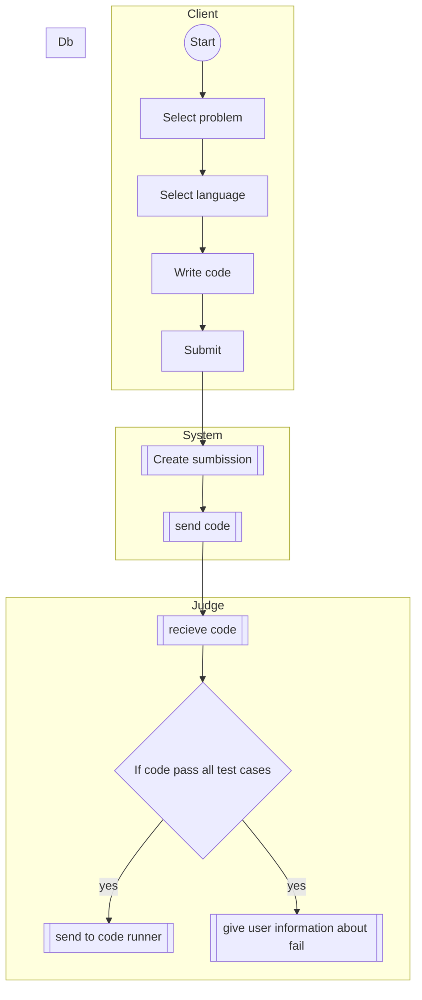

```mermaid
flowchart TD
    subgraph Client
        A((Start)) --> B[Select problem]
        B --> C[Select language]
        C --> D[Write code]
        D --> E[Submit]
        end
    subgraph System
        E --> F[[Create sumbission]]
        F --> G0[[send code]]
        
    end
    subgraph Judge
    G0 --> G1[[recieve code]]
    G1 --> G{If code pass all test cases}
    G --> |yes| G2[[send to code runner]]
    G --> |yes| G3[[give user information about fail]]
    
    end
    subgraph Db
    end
```