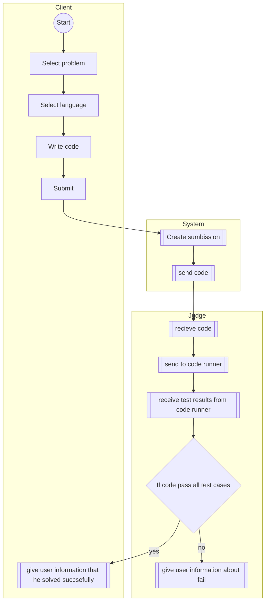

```mermaid
flowchart TD
    subgraph Client
        A((Start)) --> B[Select problem]
        B --> C[Select language]
        C --> D[Write code]
        D --> E[Submit]
        D1
        end
    subgraph System
        E --> F[[Create sumbission]]
        F --> G0[[send code]]
        
    end
    subgraph Judge
    G0 --> G1[[recieve code]]
    G1 --> G2[[send to code runner]]
    G2 --> G4[[receive test results from code runner]]
    G4 --> G{If code pass all test cases}
    G --> |no| G3[[give user information about fail]]
    G --> |yes| D1[[give user information that he solved succsefully]]
    end

```
