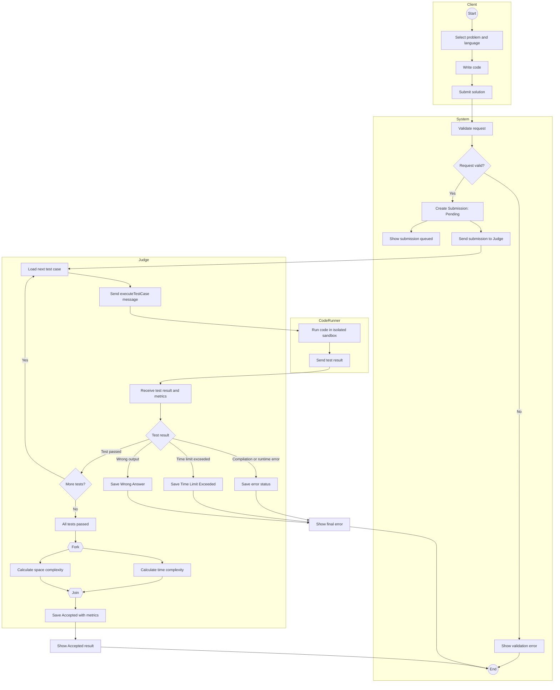

```mermaid
flowchart TD
    subgraph Client
        A(("Start")) --> B["Select problem and language"]
        B --> C["Write code"]
        C --> D["Submit solution"]
    end

    subgraph System
        D --> E["Validate request"]
        E --> F{"Request valid?"}
        F -->|"No"| G["Show validation error"]
        G --> Z(("End"))
        F -->|"Yes"| H["Create Submission: Pending"]
        H --> I["Show submission queued"]
        H --> J["Send submission to Judge"]
    end

    subgraph Judge
        J --> K["Load next test case"]
        K --> L["Send executeTestCase message"]
        M["Receive test result and metrics"] --> N{"Test result"}
        N -->|"Compilation or runtime error"| O["Save error status"]
        N -->|"Time limit exceeded"| P["Save Time Limit Exceeded"]
        N -->|"Wrong output"| Q["Save Wrong Answer"]
        N -->|"Test passed"| R{"More tests?"}
        R -->|"Yes"| K
        R -->|"No"| S["All tests passed"]
        S --> T{{"Fork"}}
        T --> U["Calculate time complexity"]
        T --> V["Calculate space complexity"]
        U --> W{{"Join"}}
        V --> W
        W --> X["Save Accepted with metrics"]
    end

    subgraph CodeRunner
        L --> Y["Run code in isolated sandbox"]
        Y --> AA["Send test result"]
    end

    AA --> M
    O --> AB["Show final error"]
    P --> AB
    Q --> AB
    X --> AC["Show Accepted result"]
    AB --> Z
    AC --> Z
```
