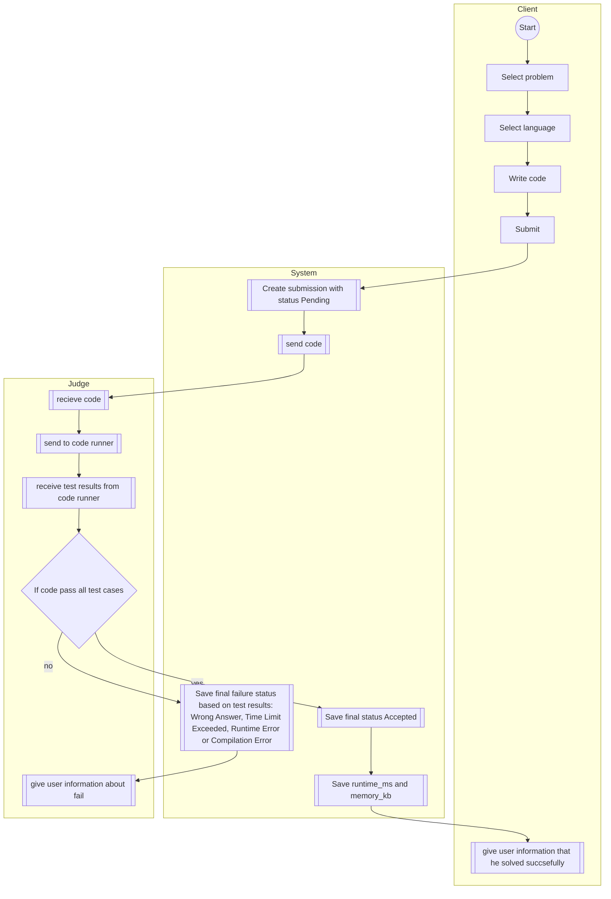

```mermaid
flowchart TD
    subgraph Client
        A((Start)) --> B[Select problem]
        B --> C[Select language]
        C --> D[Write code]
        D --> E[Submit]
        D1
        end
    subgraph System
        E --> F[[Create submission with status Pending]]
        F --> G0[[send code]]
        S1[[Save final status Accepted]]
        S2[[Save runtime_ms and memory_kb]]
        S3[[Save final failure status based on test results: Wrong Answer, Time Limit Exceeded, Runtime Error or Compilation Error]]
        
    end
    subgraph Judge
    G0 --> G1[[recieve code]]
    G1 --> G2[[send to code runner]]
    G2 --> G4[[receive test results from code runner]]
    G4 --> G{If code pass all test cases}
    G --> |no| S3
    S3 --> G3[[give user information about fail]]
    G --> |yes| S1
    S1 --> S2
    S2 --> D1[[give user information that he solved succsefully]]
    end

```
