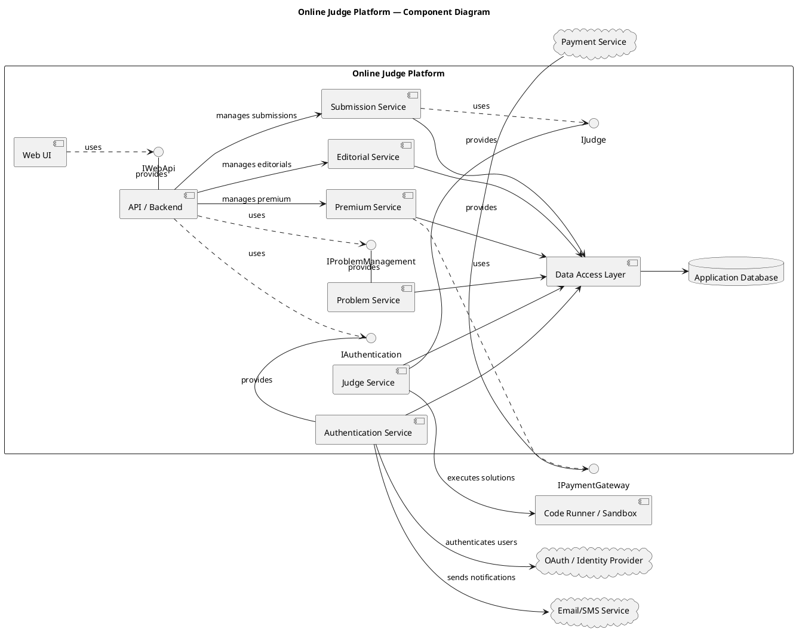

# UML Component Diagram — Lab 5

```plantuml
@startuml
title Online Judge Platform — Component Diagram

left to right direction
skinparam componentStyle uml2
skinparam packageStyle rectangle

package "Online Judge Platform" {
  component "Web UI" as WebUI
  component "API / Backend" as API
  component "Authentication Service" as Auth
  component "Problem Service" as Problems
  component "Submission Service" as Submissions
  component "Judge Service" as Judge
  component "Editorial Service" as Editorial
  component "Premium Service" as Premium
  component "Data Access Layer" as DAL
  database "Application Database" as DB

  interface "IWebApi" as IWebApi
  interface "IAuthentication" as IAuthentication
  interface "IProblemManagement" as IProblemManagement
  interface "IJudge" as IJudge
}

interface "IPaymentGateway" as IPaymentGateway
cloud "Payment Service" as Payment
cloud "OAuth / Identity Provider" as OAuth
cloud "Email/SMS Service" as Messaging
component "Code Runner / Sandbox" as Sandbox

WebUI ..> IWebApi : uses
API - IWebApi : provides

API ..> IAuthentication : uses
Auth - IAuthentication : provides
API ..> IProblemManagement : uses
Problems - IProblemManagement : provides

Submissions ..> IJudge : uses
Judge - IJudge : provides
Premium ..> IPaymentGateway : uses
Payment - IPaymentGateway : provides

API --> Submissions : manages submissions
API --> Editorial : manages editorials
API --> Premium : manages premium

Auth --> OAuth : authenticates users
Auth --> Messaging : sends notifications
Judge --> Sandbox : executes solutions

Auth --> DAL
Problems --> DAL
Submissions --> DAL
Judge --> DAL
Editorial --> DAL
Premium --> DAL
DAL --> DB
@enduml
```